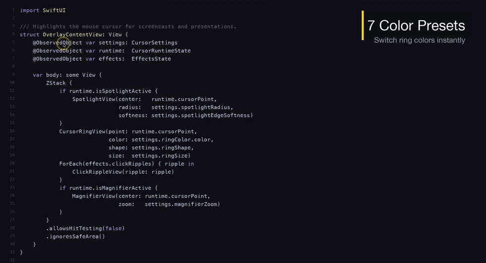
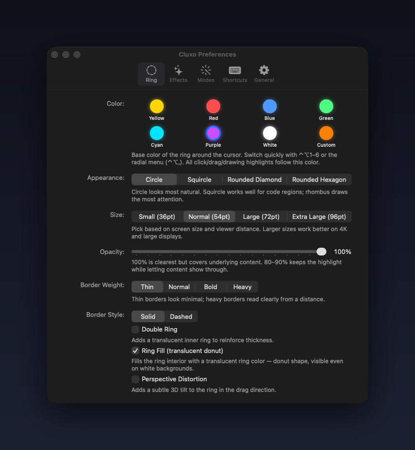
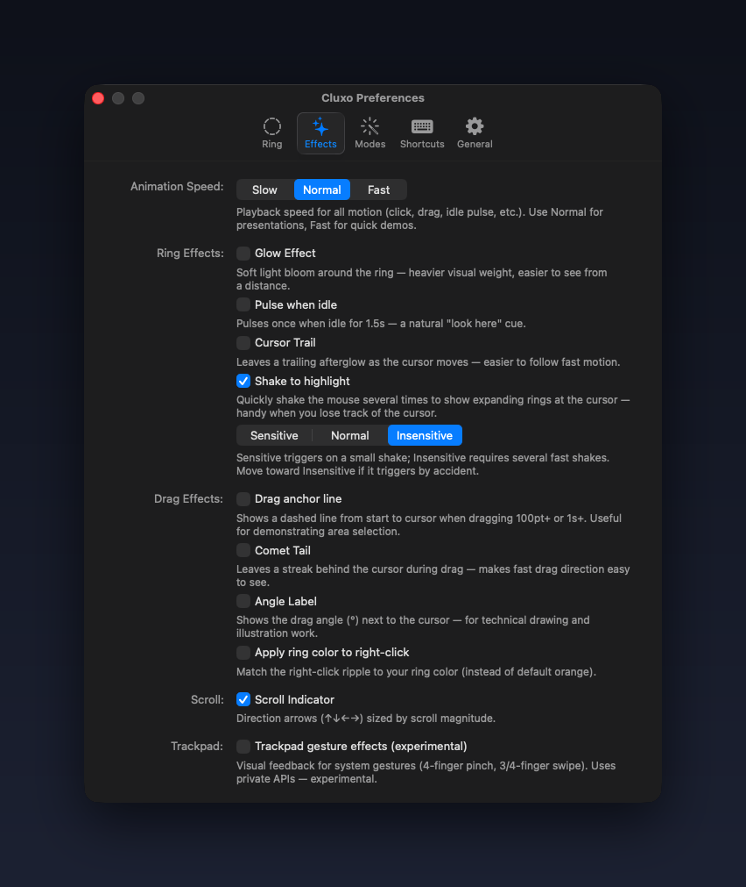
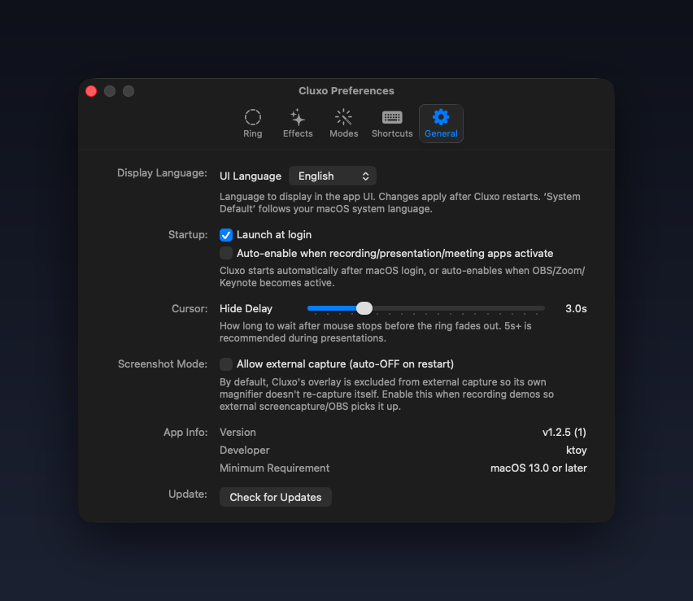

# Cluxo

[](LICENSE)
[](https://github.com/kykim79/Cluxo/releases/latest)
[](https://github.com/kykim79/Cluxo)
[](https://swift.org)
[](https://github.com/kykim79/Cluxo/releases)
[](https://github.com/kykim79/Cluxo/stargazers)

macOS menu bar app for presentations and screencasts. Visually emphasizes the mouse cursor with drawing tools, radial menu, keystroke display, spotlight, magnifier, and more — a complete helper for screen-sharing workflows.

> 🇰🇷 [한국어 README](README.md)



<a href="https://www.producthunt.com/products/cluxo?embed=true&amp;utm_source=badge-featured&amp;utm_medium=badge&amp;utm_campaign=badge-cluxo" target="_blank" rel="noopener noreferrer"></a>

## Features

- **Cursor Ring** — colored ring around the cursor (circle/squircle/rounded diamond/rounded hexagon, 4 sizes, opacity, border weight/style, glow, breathing animation)
- **Click Effects** — left (circular ripple), right (double ripple), double-click (burst), middle/wheel (rotating arcs)
- **Drag Indicator** — ring stretches in drag direction
- **Scroll Indicator** — directional arrows (↑↓←→) with magnitude-proportional size (precise scroll vs page scroll distinguished at a glance)
- **Cursor Trail** — afterglow comet tail
- **Magnifier** — real-time 1.5×–4× zoom around cursor. Adjustable lens size, Lanczos upscale + sharpening for crispness, reduced jitter while moving
- **Spotlight** — dim everything except a circle around the cursor. Smooth fade in/out when toggled (Mousepose-style), adjustable edge softness (feather) and radius
- **Keystroke Display** — show pressed shortcuts as bottom overlay. Optional auto-enable when an unknown external monitor (meeting room, etc.) connects (trusted monitors excluded)
- **Shake Detection** — shake the mouse to flash expanding rings at the cursor ("where did my cursor go?"). On/off + 3 sensitivity levels
- **Screenshot Mode** — menu bar toggle. Normally overlay window has `sharingType = .none` (so the magnifier doesn't re-capture itself), but you can flip it to `.readOnly` temporarily for external `screencapture`/OBS. Auto-OFF on app restart.
- **Radial Menu (⌃⌥, or long-press)** — 8-sector menu fans out at the cursor. Adjust effects/color/shape/spotlight/magnifier/ring-look with the menu staying open for quick multi-changes during a presentation.
  - **Two-level hierarchy** — grab an item and drag further out to fan out its detail values: spotlight (radius, edge), magnifier (zoom, lens size), ring look (size, opacity, border weight/style). The current value is highlighted with a faint accent.
  - **Drag to reposition** — grab the center and drag to move the menu anywhere (across monitors too).
  - **How to open** — `⌃⌥,`, a **long-press (0.5s) of the left mouse button**, or a **long-press on the trackpad** (handy on laptops). A 5pt deadband prevents conflict with normal drag/click.
- **Drawing Mode (⌃⌥D)** — on-screen annotation for presentations/screencasts. 7 tools: free pen, line (Shift), arrow (Opt), rectangle (Cmd), ellipse (Cmd+Shift), highlighter (Cmd+Opt), numbered badge (Shift+Opt click). While active: Cmd+Z to undo last shape, `[` / `]` to adjust thickness (5 steps). Stroke color follows the ring color.
- **Trackpad gesture feedback (experimental)** — visual labels/effects for system gestures: 4-finger pinch in/out, 3- and 4-finger swipes (↑↓←→), 5-finger pinch. Useful for showing your gestures to the audience during a presentation. Relies on the private MultitouchSupport API, so it's OFF by default — enable it in the Behavior tab of Preferences.

## Shortcuts

All shortcuts use `⌃⌥` (Control + Option):

| Key | Action |
|---|------|
| `⌃⌥S` | Toggle spotlight |
| `⌃⌥M` | Toggle magnifier |
| `⌃⌥=` | Magnifier zoom in (0.5× step, max 4.0×) |
| `⌃⌥-` | Magnifier zoom out (min 1.5×) |
| `⌃⌥K` | Toggle keystroke display |
| `⌃⌥1` | Yellow ring |
| `⌃⌥2` | Red ring |
| `⌃⌥3` | Blue ring |
| `⌃⌥4` | Green ring |
| `⌃⌥5` | Cyan ring |
| `⌃⌥6` | Purple ring |
| `⌃⌥7` | White ring |
| `⌃⌥C` | Cycle to next ring color |
| `⌃⌥H` | Cycle to next ring shape (circle → squircle → rounded diamond → rounded hexagon) |
| `⌃⌥I` | Inspector — show (x, y) system coordinates next to the cursor |
| `⌃⌥,` | **Radial Menu** — 8-sector mouse menu. Grab an item and drag further out to fan out detail values (radius/zoom/size/opacity/border…) in a second level. Grab the center to move the menu. ESC to close. **Also opens on long-press (0.5s) of the left mouse button — or a long-press on the trackpad** |
| `⌃⌥D` | **Toggle Drawing Mode** — on-screen annotation. While active: Drag=pen / **Shift**+drag=line / **Opt**+drag=arrow / **Cmd**+drag=rectangle / **Cmd+Shift**+drag=ellipse / **Cmd+Opt**+drag=highlighter / **Shift+Opt**+click=numbered badge. While active: **Cmd+Z**=undo last shape, **`[`** / **`]`**=adjust thickness, **ESC**=clear+exit. Color follows current ring color |

Some shortcuts are configurable in Preferences (menu bar → Preferences).

## Preferences

8 color slots (incl. custom), 4 ring shapes, 4 sizes, plus opacity / border / speed / effect toggles, spotlight edge softness, and shake sensitivity — all in one place. UI language (System Default / Korean / English) is selectable from the **General** tab.







## System Requirements

- macOS 13.0 or later
- Apple Silicon (current build; Universal build required for Intel)

## Installation

### Homebrew (recommended)

```bash
brew install --cask kykim79/tap/cluxo
```

Homebrew automatically removes the quarantine flag, so no Gatekeeper bypass needed. Updates: `brew upgrade --cask cluxo`.

### Manual

Download `Cluxo.zip` from [Releases](https://github.com/kykim79/Cluxo/releases):

1. Unzip → move `Cluxo.app` to `/Applications`
2. **First launch**: right-click in Finder → Open → confirm "Open" (Gatekeeper bypass, once)

If right-click → Open doesn't work:
```bash
xattr -dr com.apple.quarantine /Applications/Cluxo.app
```

### Permissions (required regardless of install method)

System Settings → Privacy & Security:
- **Accessibility** (required): mouse/keyboard event capture
- **Input Monitoring** (required): shortcut detection
- **Screen Recording** (optional): for magnifier feature

After granting, restart the app → `cursorarrow.rays` icon appears in menu bar.

## Localization

The app UI supports **Korean** and **English** based on macOS system language. To switch:

System Settings → General → Language & Region → reorder preferred languages.

## License

MIT License — see [LICENSE](LICENSE) for details.

Copyright (c) 2026 kykim79
